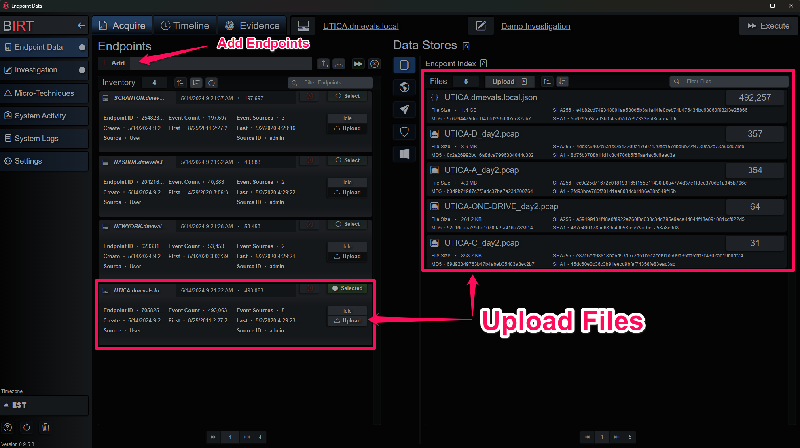

# APT29 Demo Dataset
The event log JSON entries have been separated out to form individual endpoints suitable for analysis with [BIRT Incident Response & Triage](https://www.thebirtproject.com).

## Quickstart
1. Create Endpoints by giving each a unique name, here we use the endpoint Hostname.
2. Add data by clicking the upload button on the endpoint card or on the Data Stores tab when the endpoint is selected.
3. BIRT will parse the events in the files, compile them and then run the Micro-Technique Engine, producing evidence.

